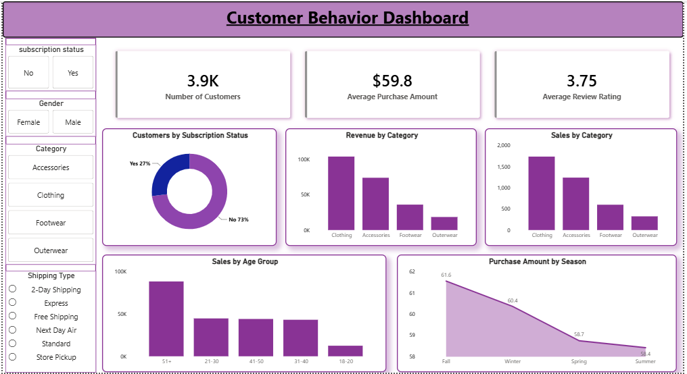

# 🛒 Customer Shopping Behavior Analysis

> **An End-to-End Data Analytics Project using SQL, Python, Excel & Power BI**

---

## 📌 Project Overview

This project analyzes customer shopping behavior to uncover purchasing patterns, customer preferences, and business insights. The complete analytics workflow includes data cleaning, SQL analysis, Python-based exploratory data analysis (EDA), interactive Power BI dashboard creation, and business reporting.

---

## 🎯 Objectives

- Analyze customer shopping behavior.
- Identify purchasing trends and spending patterns.
- Discover high-performing product categories.
- Build an interactive Power BI dashboard.
- Generate actionable business insights.

---

## 🛠️ Tools & Technologies

| Category | Tools |
|----------|-------|
| Programming | Python |
| Database | SQL |
| Data Analysis | Pandas, NumPy |
| Visualization | Power BI |
| Spreadsheet | Microsoft Excel |
| Version Control | Git & GitHub |

---

## 📂 Project Files

📄 Customer Shopping Dataset (.csv)

🗄️ SQL Analysis Script (.sql)

🐍 Python Analysis Notebook (.ipynb)

📊 Power BI Dashboard (.pbix)

📑 Project Report (.pdf)

📽️ Project Presentation (.pptx)

---

# 📊 Dashboard Preview



---

## 📈 Key Insights

- Identified customer purchasing trends.
- Analyzed customer spending behavior.
- Compared category-wise sales performance.
- Built an interactive dashboard for business reporting.
- Generated actionable insights for decision-making.

---

## 📁 Repository Structure

```
Customer-Shopping-Behavior-Analysis
│
├── customer_shopping_behavior.csv
├── customer_behavior_analysis.sql
├── customer_behavior_analysis.ipynb
├── customer_behavior_dashboard.pbix
├── dashboard_preview.png
├── project_report.pdf
├── project_presentation.pptx
└── README.md
```

---

## 🚀 Skills Demonstrated

- Data Cleaning
- Exploratory Data Analysis (EDA)
- SQL Query Writing
- Data Visualization
- Dashboard Development
- Business Analytics
- Reporting
- Problem Solving

---

## 📬 Connect With Me

- 💼 LinkedIn: [Aryan Rai](https://www.linkedin.com/in/aryanrai-dataanalyst/)
- 📧 Email: <aryanrai8572@gmail.com>
- 🐙 GitHub: [Aryan349409](https://github.com/Aryan349409)
---

## ⭐ If you like this project, consider giving it a star!
